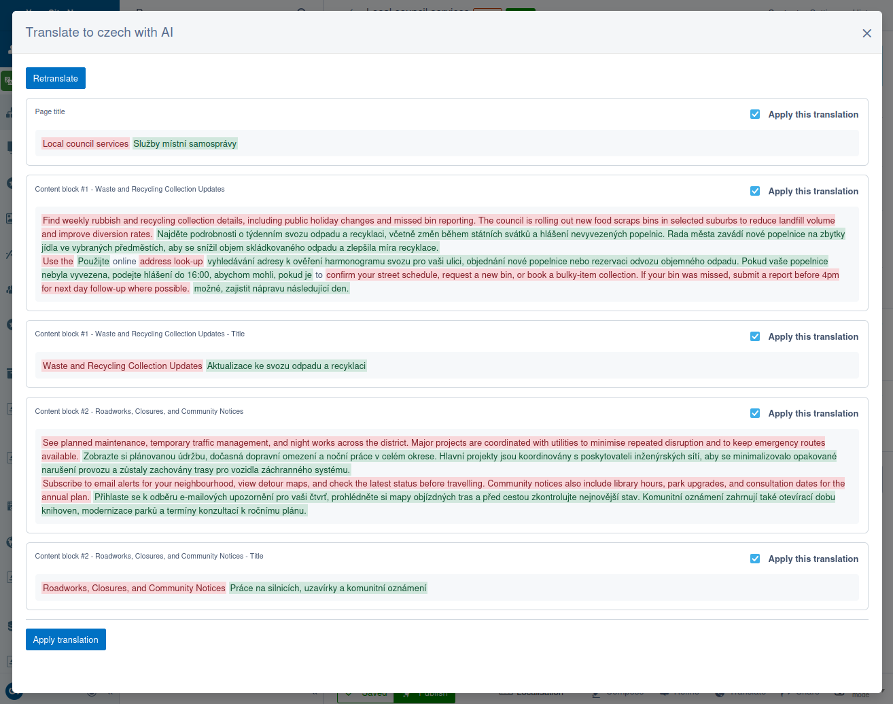

# AI translate module for Silverstripe CMS

AI-assisted translation review and selective-apply workflow for Silverstripe CMS with Fluent.



Extracts stable per-field translation targets from the source locale, asks the configured AI provider for structured JSON suggestions, and lets editors selectively apply approved suggestions back to target-locale Draft content. Results are cached only for the current CMS session and are not persisted to a module-owned table.

## Installation

This module is currently not listed on Packagist. To install it, add the following to your project's `composer.json`:

```json
{
    "repositories": [
        {
            "type": "vcs",
            "url": "git@github.com:silverstripeltd/silverstripe-ai-translate.git"
        }
    ],
    "require": {
        "silverstripeltd/ai-translate": "*"
    }
}
```

Then run `composer install` followed by `vendor/bin/sake dev/build flush=1` to register the module's routes, extensions, and config.

### Prerequisites

- Silverstripe CMS 6
- [Fluent](https://github.com/tractorcow-farm/silverstripe-fluent) configured with at least one non-default locale
- A valid API key for one of the supported AI providers (Gemini, OpenAI, or Anthropic)

## Supported content

Translation targets are limited to text-based fields on the page and its Elemental content blocks. Specifically, the module supports:

- **TextField** fields (`Varchar` database type)
- **TextareaField** fields (`Text` database type)
- **HTMLEditorField** (WYSIWYG) fields (`HTMLText`, `HTMLVarchar` database types)
- **Page Title and Content** fields

Other field types (e.g. dropdowns, dates, checkboxes) and content on related objects (e.g. a linked Banner's heading) are not included in the translation. If related objects have their own translatable fields, they need to be translated separately via their own CMS edit forms.

## Usage

1. Switch to a non-default Fluent locale in the CMS.
2. Ensure the record is already localised in the target locale (the button will not appear otherwise).
3. Click the "Translate" button on the page edit form.
4. Click "Translate content" to fetch per-field suggestions for the saved Draft content.
5. Review the suggestion cards, including source-locale context and server-generated diffs.
6. Apply only the selected suggestions back to target-locale Draft content.

### Draft and Live behaviour

`Draft` content is always used. Both the source-locale and target-locale content are read from `Draft`. Apply writes to target-locale `Draft` only.

## Configuration

All configuration is via environment variables (e.g. in your webserver env or `.env`). Restart your webserver after changing any values.

### Provider

Set the AI provider and API key. Gemini, OpenAI, and Anthropic are supported out of the box. Custom providers can be added by extending `AbstractAIProvider`.

```bash
AI_TRANSLATE_PROVIDER=gemini              # gemini (default), openai, or anthropic
AI_TRANSLATE_API_KEY=your-api-key         # API key for the chosen provider
```

### Model

Control which model is used and how it generates responses. All optional - sensible defaults are used if omitted.

```bash
AI_TRANSLATE_MODEL=gemini-2.5-flash       # Model identifier (provider-specific)
AI_TRANSLATE_THINKING_LEVEL=low           # Thinking effort: none, low, medium, or high
AI_TRANSLATE_TEMPERATURE=1.0              # Sampling temperature
AI_TRANSLATE_MAX_TOKENS=2000              # Max tokens in AI response
AI_TRANSLATE_REQUEST_TIMEOUT=15           # Timeout per AI request in seconds
```

Translation responses include both source and translated text, so they are roughly double the size of the input. Long pages may need `AI_TRANSLATE_MAX_TOKENS` increased.

## Deployment note

This module no longer persists generated translation documents. When upgrading from the legacy workflow, remove the obsolete `AiTranslation` table as part of deployment.

---

## Development

### AI tooling

AI tools (e.g. Claude Code) should be run from the **project root**, not from within this directory. The module's `CLAUDE.md` should be symlinked to the project root so that AI tools pick it up automatically:

```bash
cd path/to/project

if [ -f CLAUDE.md ] || [ -L CLAUDE.md ]; then rm -f CLAUDE.md; fi
ln -s vendor/silverstripeltd/ai-translate/CLAUDE.md CLAUDE.md
```

`CLAUDE.md` contains project identity, hard constraints, directory structure, and module-specific testing, spec-editing, and command conventions. Note that it contains instructions for a specific Docker setup - you may need to update it to match your local environment.

### Running tests and linting

From the project root:

- PHP unit tests:
  - `vendor/bin/phpunit vendor/silverstripeltd/ai-translate/tests/ --fail-on-warning`
- PHP linting:
  - `cd vendor/silverstripeltd/ai-translate && ../../bin/phpcs --ignore=*/thirdparty/*,*/node_modules/* --extensions=php .`
- JS tests:
  - `cd vendor/silverstripeltd/ai-translate && yarn test`
- JS linting:
  - `cd vendor/silverstripeltd/ai-translate && yarn lint`

### Technical details

See `specs/` for technical specifications.
